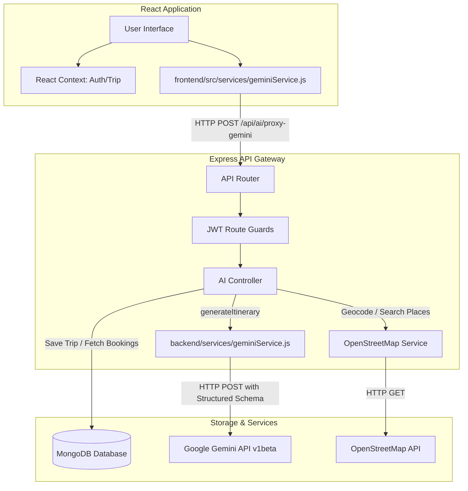

# AI Travel Planner - Technical Developer Guide

This document provides a detailed breakdown of the system architecture, database models, AI integrations, and deployment configurations of the AI Travel Planner. It is designed to help team members get up to speed with the codebase and understand how the application functions under the hood.

---

## 🗺️ System Architecture

The AI Travel Planner is built on a decoupled, full-stack architecture. The frontend handles interactive planning forms and state management, communicating with the Node.js/Express backend via HTTP/JSON. The backend interacts with MongoDB for persistent storage and acts as a gateway to external APIs (OpenStreetMap and Google Gemini).



---

## 🗄️ Database Schemas

All schemas are declared using Mongoose ODM in `backend/models/`.

### 1. User Model (`User.js`)
Handles authentication credentials and profile preferences.
* **Fields**:
  * `name` (String, required)
  * `email` (String, required, unique)
  * `password` (String, required, hashed using `bcryptjs`)
  * `preferences` (Object containing default interests, budget level, and travel mode)

### 2. SavedTrip Model (`SavedTrip.js`)
Stores AI-generated itineraries associated with users.
* **Fields**:
  * `user` (ObjectId ref to `User`, required)
  * `destination` (String, required)
  * `startDate` (Date, required)
  * `endDate` (Date, required)
  * `tripData` (Mixed object representing the full structured itinerary returned by Gemini)

### 3. Hotel Model (`Hotel.js`)
Contains data on pre-seeded hotels available for recommendation.
* **Fields**:
  * `name` (String, required)
  * `location` (String, required)
  * `rating` (Number)
  * `price` (Number, nightly rate in INR)
  * `description` (String)
  * `amenities` (Array of Strings)

### 4. Booking Model (`Booking.js`)
Saves hotel booking confirmations created by the user.
* **Fields**:
  * `user` (ObjectId ref to `User`, required)
  * `tripId` (ObjectId ref to `SavedTrip`, required)
  * `hotelName` (String, required)
  * `checkIn` (Date, required)
  * `checkOut` (Date, required)
  * `guests` (Number)
  * `totalPrice` (Number)

---

## 🔑 Authentication Workflow

We implement JWT (JSON Web Tokens) for stateless authentication:
1. **User Registration / Login**: The backend receives credentials, hashes passwords using `bcryptjs`, and compiles a JWT token containing the `_id` of the user.
2. **Token Injection**: The token is sent to the client and stored in `localStorage` under `token`.
3. **Route Guarding**: The backend middleware (`backend/middleware/authMiddleware.js`) intercepts requests to protected endpoints, parses the header `Authorization: Bearer <token>`, and attaches the user model to the Request context (`req.user`).

---

## ✈️ Google Gemini API Integration

The core intelligent features are powered by Google Gemini `v1beta` models using direct REST fetch calls to avoid SDK-level dependency overheads.

### 1. Model Configuration
* **Active Model**: `gemini-3.6-flash` is configured natively to provide low latency, cheap token costs, and high-performance reasoning for trip schedules.
* **Key Validation**: Validation checks in the backend verify that the user's API key is configured. Keys starting with the new Google AI Studio format `AQ.` are supported, ensuring the validation logic remains opaque.

### 2. Structured JSON Output
To ensure the model always outputs clean JSON conforming to our frontend rendering components:
* We provide a **Response Schema** in the REST request body configuration (`generationConfig.responseSchema`):
  ```javascript
  generationConfig: {
    temperature: 0.7,
    maxOutputTokens: 4000,
    responseMimeType: "application/json",
    responseSchema: itinerarySchema
  }
  ```
* The schema forces Gemini to output structured keys (`destination`, `summary`, `journey`, `stay`, `days`, `budget`, `recommendations`, `packing`, `tips`).

### 3. Verification & OpenStreetMap Fallback
Before sending the itinerary request to Gemini, the backend calls the OpenStreetMap (OSM) Service to search for real, mapped tourist attractions and parks inside the target destination. These real attractions are injected into the prompt, forcing Gemini to build the schedule using **verified locations** rather than fabricating fictitious attractions. If the Gemini API fails, a robust fallback generator maps attractions directly to a mock itinerary to preserve user experience.

---

## 🌐 SPA Routing on GitHub Pages

Hosting a Single Page Application (SPA) with nested routing (React Router) on GitHub Pages normally results in `404` errors when a user refreshes the page on a subpath (e.g. `/planner`). To circumvent this, the following steps were taken:

1. **Vite Base Path**: Configured `base: "/AI-Travel-Planner/"` in `frontend/vite.config.js` to ensure built assets resolve under the repository subdirectory.
2. **SPA Redirect Script**: Added a redirection script inside [frontend/public/404.html](file:///c:/AI-Travel-Planner/frontend/public/404.html) which redirects page refreshes back to `index.html` while carrying the target subpath query param.
3. **Redirection Parsing**: A parsing script at the top of [frontend/index.html](file:///c:/AI-Travel-Planner/frontend/index.html#L20-L40) extracts the query param, updates the window history, and permits React Router to parse and render the correct view seamlessly.
